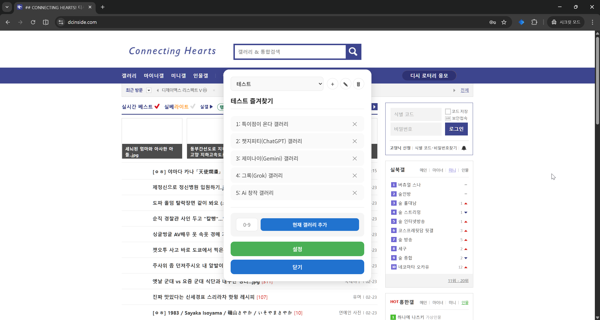
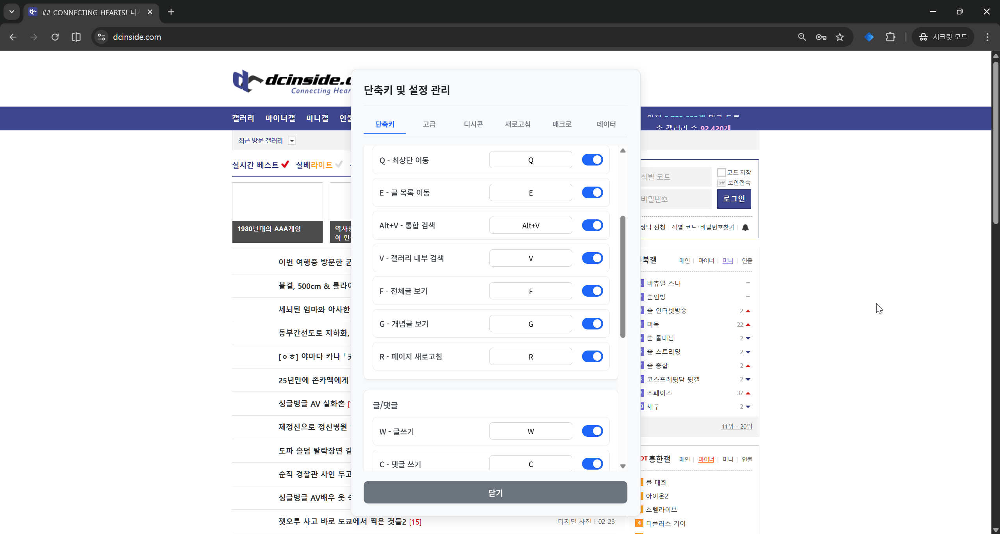

# DCInside ShortCut

디시인사이드를 키보드만으로 이용하는 것을 지향하는 프로젝트입니다.
자주 쓰는 동작을 단축키로 실행하고, 즐겨찾는 갤러리 이동 단축키/게시글 탐색 단축키/디시콘 즐겨찾기 기능을 지원합니다.


## 주요 기능

- 커스터마이징 가능한 단축키
- 갤러리 즐겨찾기 빠른 이동/등록
- 다음 글/이전 글 이동 단축키
- 댓글 입력창에서 `@디시콘 이름`으로 디시콘 빠른 사용
- 갤러리 자동 새로고침 기능 지원

## 스크린샷

> 캡처 이미지는 `docs/screenshots` 경로를 기준으로 연결되어 있습니다.

| 화면 | 미리보기 |
| --- | --- |
| 갤러리 즐겨찾기 |  |
| 단축키/설정 |  |
| 디시콘 단축키 |  |

## 단축키

### 커스텀 가능

| 키 | 동작 |
| --- | --- |
| `W` | 글쓰기 |
| `C` | 댓글 입력 |
| `D` | 댓글 이동 |
| `R` | 새로고침 |
| `Q` | 최상단 스크롤 |
| `E` | 글 목록 스크롤 |
| `F` | 전체글 |
| `G` | 개념글 |
| `A` | 다음 페이지 |
| `S` | 이전 페이지 |
| `Z` | 다음 글 |
| `X` | 이전 글 |
| `Alt + V` | 통합 검색 |
| `V` | 갤러리 내부 검색 |
| `[` | 즐겨찾기 이전 프로필 |
| `]` | 즐겨찾기 다음 프로필 |
| ``Alt + \`` | 갤러리 즐겨찾기 열기 |
| `Alt + 0~9` | 갤러리 즐겨찾기 이동/등록 |
| `Alt + W` | 글 등록 |
| `Alt + D` | 댓글 등록 |
| `Alt + Z / Alt + X` | 자동 넘김 시작/중지 |
| `` ` `` 또는 `.` + 숫자 | 게시글 라벨 번호로 이동 |
| `0~9` | 게시글 라벨 번호 바로가기 |

## 설치 방법 (개발자 모드)

1. 저장소를 클론합니다.
2. 의존성을 설치합니다.

```bash
npm install
```

3. 확장 프로그램 빌드:

```bash
npm run build
```

4. Chrome/Edge에서 `확장 프로그램` 페이지로 이동합니다.
5. `개발자 모드`를 켜고 `압축해제된 확장 프로그램을 로드`를 선택합니다.
6. 프로젝트의 `dist` 폴더를 선택합니다.

## 개발

```bash
npm run type-check
npm run build:dev
```

- 빌드 결과물은 `dist`에 생성됩니다.
- 버전은 `manifest.json`과 동기화됩니다 (`npm run version:sync`).

## 기술 스택

- Vue 3
- TypeScript
- Vite

## 로드맵

- 대왕콘/더블콘 지원
- 다크모드 지원

## 문의

- nonohako [갤로그 방명록](https://gallog.dcinside.com/nonohako/guestbook)

## License

[MIT](./LICENSE)