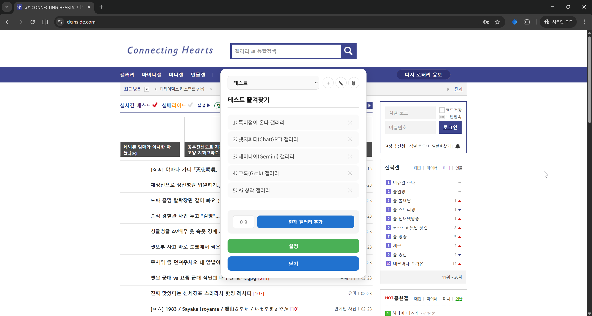
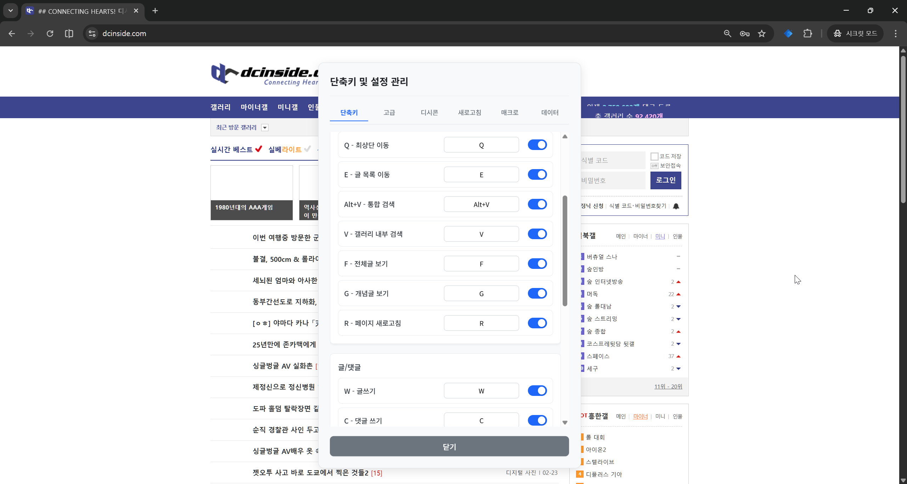

# DCInside ShortCut

디시인사이드를 키보드만으로 이용하는 것을 지향하는 프로젝트입니다.
자주 쓰는 동작을 단축키로 실행하고, 즐겨찾는 갤러리 이동 단축키/게시글 탐색 단축키/디시콘 즐겨찾기 기능을 지원합니다.


## 주요 기능

- 커스터마이징 가능한 단축키와 설정 전체 켜기/끄기
- 폴더별 무제한 갤러리 즐겨찾기와 빠른 이동/등록
- 즐겨찾기 폴더·항목 드래그 이동 및 순서 변경
- 모든 폴더 통합 검색, 한글 실시간 검색 및 초성 검색
- 즐겨찾기 여러 항목 일괄 이동/삭제
- `Alt + 0~9` 또는 사용자 지정 조합을 즐겨찾기 단축키로 지정
- 크기를 조절할 수 있는 즐겨찾기 관리 창
- 다음 글/이전 글 이동 단축키
- 댓글 입력창에서 `@디시콘 이름`으로 디시콘 빠른 사용
- 갤러리 자동 새로고침 기능 지원
- 시스템 설정을 따르는 라이트/다크 테마

## v0.4.0 주요 변경

- 기존 0~9 제한형 즐겨찾기를 폴더 기반 무제한 목록으로 개편했습니다.
- 마우스 드래그로 폴더 이동과 목록 순서 변경이 가능하며, 이동 위치를 실시간으로 미리 보여줍니다.
- 모든 폴더 검색, 한글 조합 중 실시간 검색, 초성 검색을 지원합니다.
- 즐겨찾기 단축키에 `Custom` 입력을 추가하고 기존 기능 단축키와의 충돌을 검사합니다.
- 즐겨찾기 창과 폴더 영역의 크기를 드래그로 조절하고 크기를 저장할 수 있습니다.
- 최소 전역 단축키 감지 스크립트만 모든 URL에 적용합니다. DC 전용 기능은 `*.dcinside.com`에서만 실행됩니다.
- 설정의 모든 스위치를 한 번에 켜거나 끌 수 있습니다.

## 스크린샷

| 기능 | 미리보기 |
| --- | --- |
| 갤러리 <br> 북마크 |  |
| 단축키 <br> 설정 |  |
| 디시콘 <br >단축키 |  |

## 단축키

### 커스텀 가능

| 키 | 동작 |
| --- | --- |
| `W` | 글쓰기 |
| `C` | 댓글 입력 |
| `D` | 댓글 이동 |
| `R` | 새로고침 |
| `Q` | 최상단 스크롤 |
| `E` | 글 목록 스크롤 |
| `F` | 전체글 |
| `G` | 개념글 |
| `A` | 다음 페이지 |
| `S` | 이전 페이지 |
| `Z` | 다음 글 |
| `X` | 이전 글 |
| `Alt + V` | 통합 검색 |
| `V` | 갤러리 내부 검색 |
| `[` | 즐겨찾기 이전 폴더 |
| `]` | 즐겨찾기 다음 폴더 |
| ``Alt + ` `` | 갤러리 즐겨찾기 열기 |
| `Alt + 0~9` | 갤러리 즐겨찾기 이동/등록 |
| 사용자 지정 | 즐겨찾기별 Custom 단축키 |
| `Alt + W` | 글 등록 |
| `Alt + D` | 댓글 등록 |
| `Alt + Z / Alt + X` | 자동 넘김 시작/중지 |
| `` ` `` 또는 `.` + 숫자 | 게시글 라벨 번호로 이동 |
| `0~9` | 게시글 라벨 번호 바로가기 |

## 설치 방법

### 확장프로그램 설치
- [Chrome Web Store](https://chromewebstore.google.com/detail/dcinside-shortcut/egojoffmbccdmdllejmaahbochbfdhbh?authuser=0&hl=ko)
### 직접 빌드

1. 저장소를 클론합니다.
2. 의존성을 설치합니다.

```bash
pnpm install
```

3. 프로덕션 확장 프로그램을 빌드합니다.

```bash
pnpm run build
```

4. Chrome/Edge에서 `확장 프로그램` 페이지로 이동합니다.
5. `개발자 모드`를 켜고 `압축해제된 확장 프로그램을 로드`를 선택합니다.
6. 프로젝트의 `dist` 폴더를 선택합니다.

개발 중 소스맵이 포함된 빌드가 필요하면 다음 명령을 사용합니다.

```bash
pnpm run build:dev
```

## 권한 범위

- 최소 전역 단축키 감지 스크립트는 즐겨찾기 창 열기처럼 사이트와 독립적인 기능을 위해 `<all_urls>`에서 실행됩니다.
- 게시글 이동, 댓글 등록, 갤러리 탐색 등 DC 전용 기능은 기존처럼 `*.dcinside.com` 범위에서만 실행됩니다.
- 즐겨찾기와 설정 데이터는 `chrome.storage.local`에 저장됩니다.

## 기술 스택

- Vue 3
- TypeScript
- Vite

## 로드맵

- 대왕콘/더블콘
- 즐겨쓰는 디시콘 단축키
- 파이어폭스 지원

## 문의

- [nonohako 갤로그 방명록](https://gallog.dcinside.com/nonohako/guestbook)

## License

[MIT](./LICENSE)
